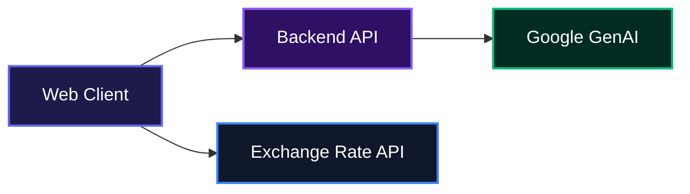
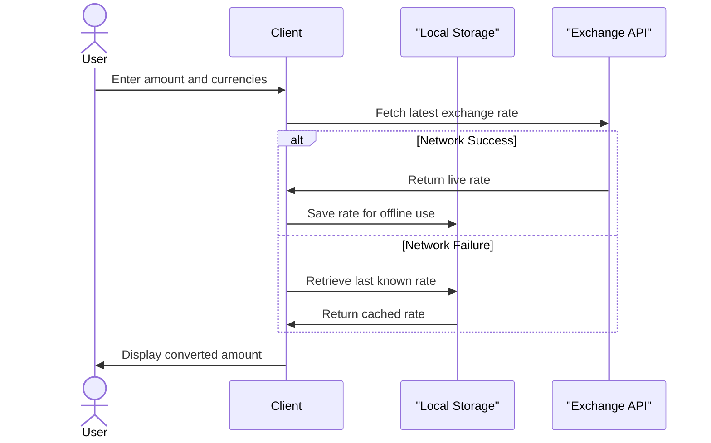
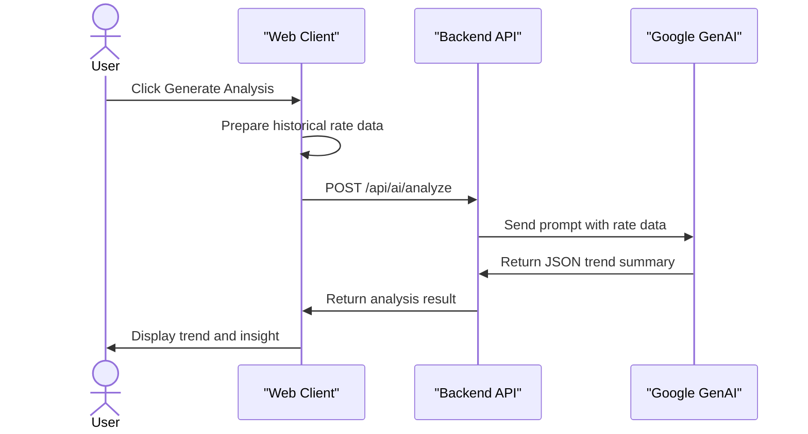

# Foreign Exchange Checker

Foreign Exchange Checker helps users convert currencies using real-time market data while providing deep insights into historical exchange rate trends. It takes standard currency pairs, visualizes their performance over time, and generates automated market analysis so teams do not have to guess where the market is heading.

## System Architecture



## Usage

Users can open the application in any modern web browser to perform immediate currency conversions. Select a base currency and a target currency from the dropdown menus to see the current exchange rate and the converted amount.

To share a specific conversion pair with colleagues, append the currency codes to the URL parameters like this:

```text
https://example.com/?from=USD&to=EUR
```

The application includes an insights panel below the conversion form. Users can click through the tabs to view historical charts, compare rates against multiple currencies, check pinned favorites, or review their local conversion log.

For faster navigation, the application supports keyboard shortcuts. Pressing these keys will trigger the following actions:

- **Ctrl/Cmd + K**: Open the currency search menu.
- **S**: Swap the currently selected currencies.

To generate an AI analysis of a specific currency pair, select the "AI Analyst" tab and click the generate button. The application will process the historical data for the selected date range and provide a trend summary along with key market insights.

## Features

### Real-Time Conversion

Instantly convert amounts between dozens of global currencies using up-to-date market rates. The system features offline resilience, automatically falling back to locally cached rates if network connectivity drops.



### AI Market Analyst

Generate automated, plain English summaries that explain historical rate movements and their potential implications using Google GenAI.



### Historical Charts

Visualize exchange rate movements over customizable periods ranging from 1 day to 5 years. This helps users spot long-term trends and short-term volatility.

### Multi-Currency Comparison

View how a specific base amount translates across a list of popular or pinned currencies at a single glance.

### Favorites and Logging

Pin frequently used pairs for quick access and maintain a private, local history of past conversions. The local conversion log can also be exported as a CSV file.

## Technologies Used

| Technology     | Description                         |
| :------------- | :---------------------------------- |
| React          | Frontend UI library                 |
| TypeScript     | Strongly typed programming language |
| Vite           | Frontend build tool                 |
| Tailwind CSS   | Utility-first CSS framework         |
| TanStack Query | Asynchronous state management       |
| Zustand        | Client state management             |
| Recharts       | Composable charting library         |
| Google GenAI   | Backend AI processing               |

## Author

- LinkedIn: https://linkedin.com/in/emmanuel-ihemedu
- X: https://x.com/deraamaobi

## Built With

[](https://react.dev/)
[](https://www.typescriptlang.org/)
[](https://vitejs.dev/)
[](https://tailwindcss.com/)
[](https://expressjs.com/)
